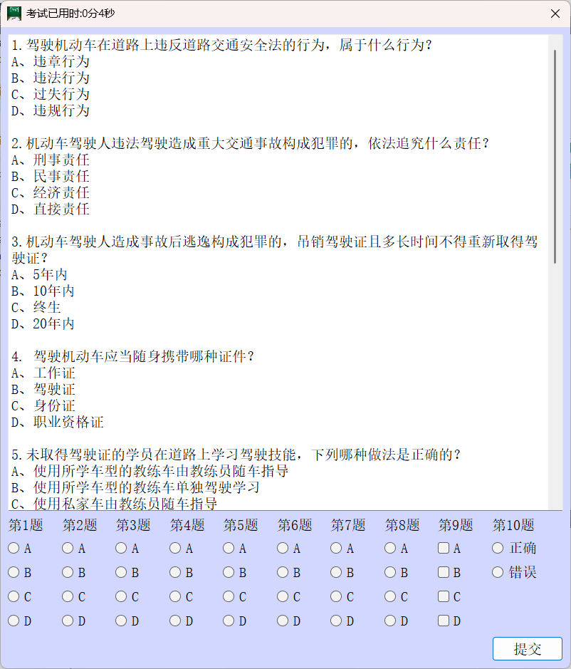

# ExamSys
[English Version Click Here](README_en.md)

## 项目简介
本项目是一个基于Qt5的科目一考试系统，用户通过账号密码登录进入系统，系统读取题库然后进行考试，考试结束后自动提交答案，并显示成绩。

该项目现在结束，打算重新开发新的数据库保存题库，而且还要开发一个后台程序来更新题库。这个项目只是拿来学习一些基本的QT知识，以及如何使用来发布程序的安装包。（这部分不在项目中解释）

## 项目结构
项目包含以下文件和目录：

```shell
│   .gitignore
│   dialog.cpp
│   examdialog.cpp
│   examdialog.h
│   ExamSys.pro
│   ExamSys.pro.user
│   image.qrc
│   logindialog.cpp
│   logindialog.h
│   logindialog.ui
│   main.cpp
│   main.png
│   README.md
│   README_en.md
│   ui_logindialog.h
└───res
        account.txt # 账户的位置
        exam.txt # 试题的位置
        login.ico # 设置了程序的图标
        login.png # 登录界面的背景
```

## 关键流程说明

### 登录界面

读取登录的文件列表，然后用逗号进行分割，验证用户的输入后，再进行比对，这个正则如下。

```cpp
    QRegExp rx("^[A-Za-z0-9]+([_\.][[A-Za-z0-9]+)*@([[A-Za-z0-9\-]+\.)+[[A-Za-z]{2,6}$");
```

其他输入很常规的文件读取，使用`QtDialog`的信号，来获取登录成功的状态。样式的大部分设置都在UI文件里面，代码了仅仅设置了窗口的属性，以及固定窗口的大小

### 主界面

自己画的一个界面，用的是`QGridLayout`，用代码调整了背景颜色。初始化了计时器，布局和按钮，然后读取文件，初始化试题区域。中间还是很正常的文件读取。

采取了大量的手动连接信号。

知识点：如何关闭计时器

```cpp
QTimer::singleShot(0,qApp,SLOT(quit()));//关闭计时器
```


## 使用说明

项目的主要界面的截图，选择所有的选项后，就会显示分数，然后可以点击重做。



项目登录界面的截图


程序运行的时候，需要将res文件复制到文件目录下，才能正确读取其中的内容，账户和示例密码都在其中，你也可以自己定义。

## 许可证

本项目采用MTT许可证，具体内容请参考LICENSE文件。